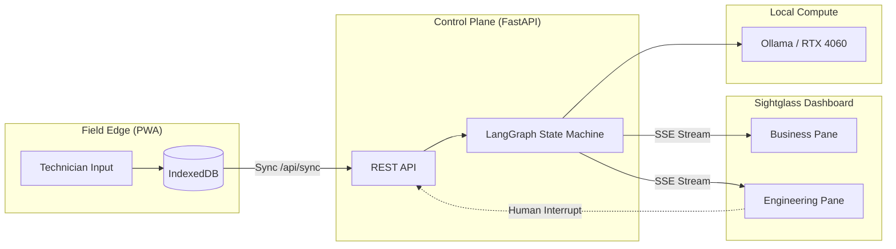

# Sightglass

**Sightglass** is a local-first, human-in-the-loop agentic control plane for field operations. It makes the invisible engineering visible by streaming live LangGraph state transitions directly to a split-screen dashboard.

## Architecture



## Principles
* **Observable:** Every node transition is streamed via SSE.
* **Interruptible:** Human-in-the-loop gates prevent hallucinated orders.
* **Local-First:** Runs entirely on local hardware (RTX 4060 / Ollama).

## Graph

`Intake` (Ollama `llama3.1:8b` part extraction) → `Inventory` (mock warehouse, HITL if cost > $500) → `HITL` (checkpointed pause) or `END`.

## Run

Ollama must be serving `llama3.1:8b` at `http://localhost:11434`.

```bash
# Control plane
cd backend
python -m venv .venv && source .venv/bin/activate
pip install -r requirements.txt
uvicorn main:app --reload --port 8000

# Dashboard
cd frontend
npm install
npm run dev
```

Open `http://localhost:3000`. Submit a field ticket on the left. The engineering pane maps live node transitions. Parts over $500 pause at HITL until **Approve Order** resumes the checkpointed graph.
