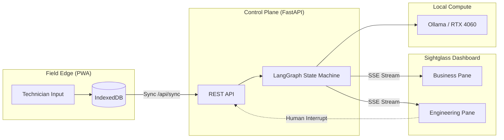

# Sightglass

**Sightglass** is a local-first, human-in-the-loop agentic control plane for field operations. It makes the invisible engineering visible by streaming live LangGraph state transitions directly to a split-screen dashboard.

## Architecture

## Principles
* **Observable:** Every node transition is streamed via SSE.
* **Interruptible:** Human-in-the-loop gates prevent hallucinated orders.
* **Local-First:** Runs entirely on local hardware (RTX 4060 / Ollama).